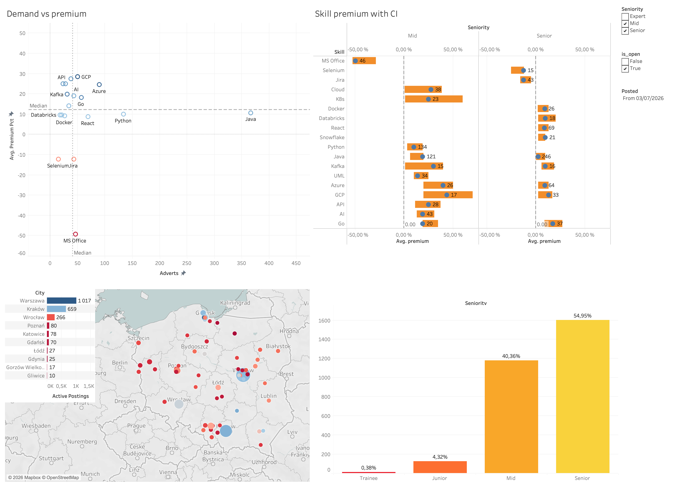
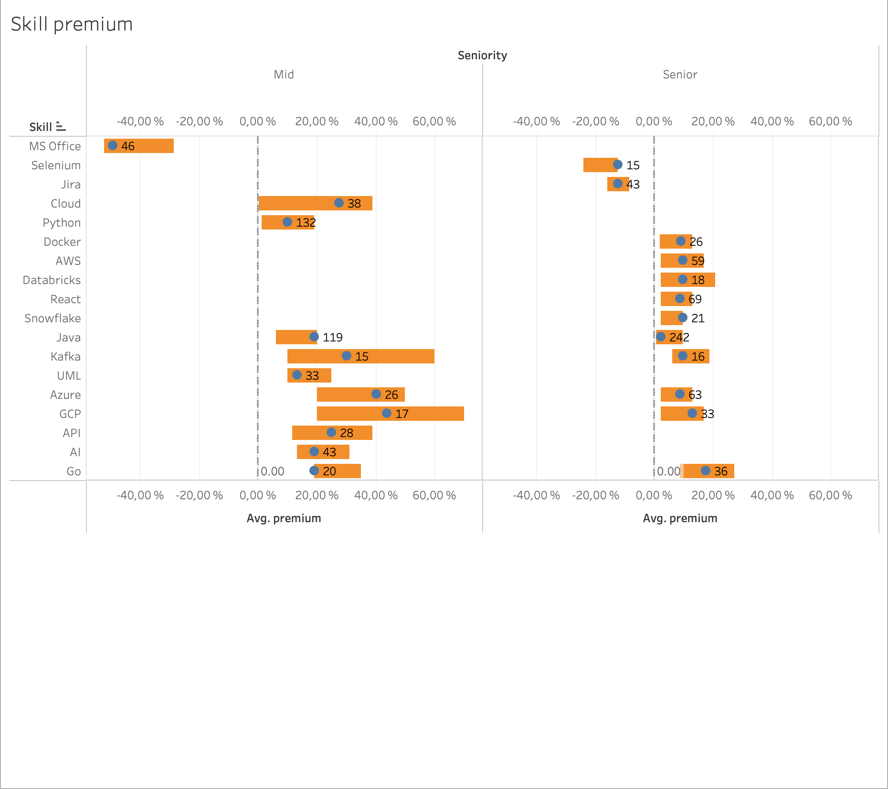
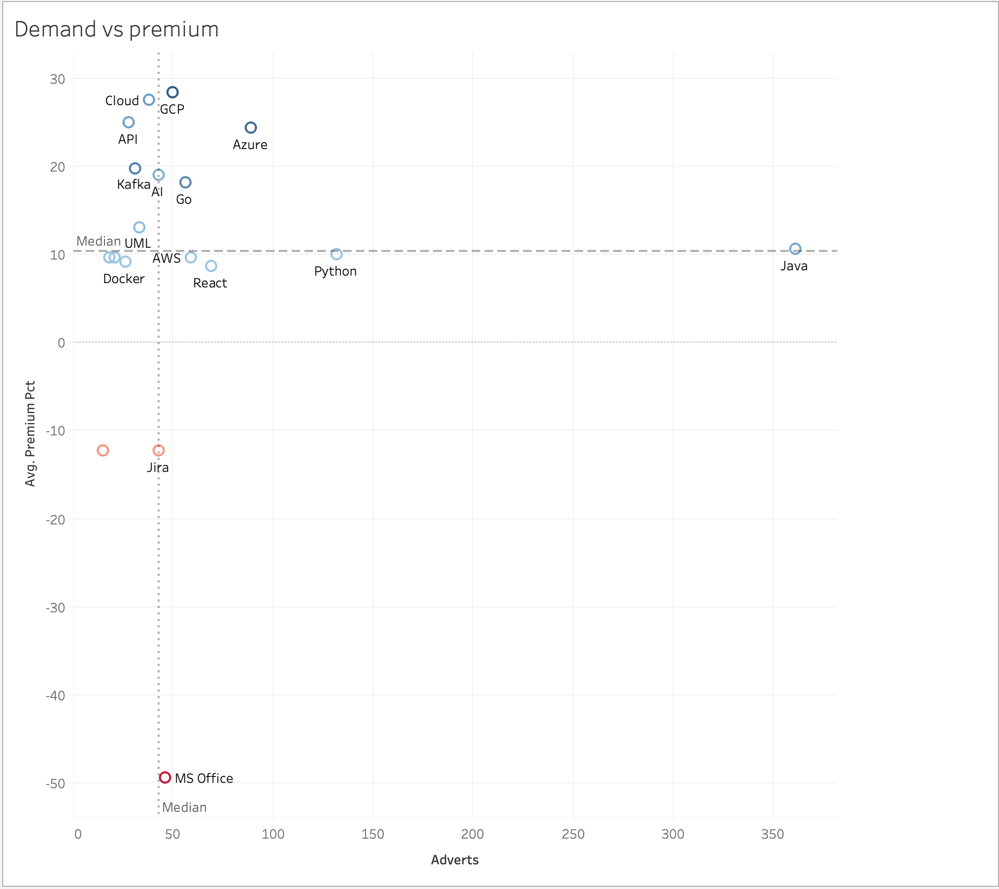
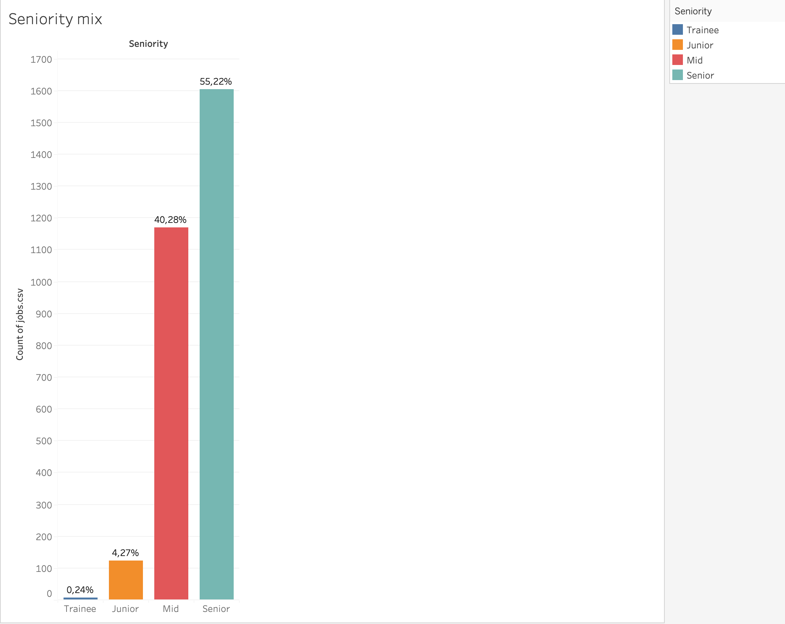

# Polish IT Job Market Analytics

Daily snapshots of job adverts from No Fluff Jobs, turned into flat tables and 
Tableau dashboard: what a skill is actually worth once seniority is held constant.



The workbook is `dashboard/No_Fluff_Jobs.twb`: skill premium with its confidence
intervals, demand against premium, active postings by city, and the seniority
mix. It reads the three CSVs that `src/build.py` writes.

Two questions it answers today:

1. **What a skill is worth** once seniority is held constant, and which of those
   premiums survive a check on how few adverts they rest on.
2. **How demand and pay relate** — the most requested skills are not the best
   paid ones.

A third — **how the market moves over time** — needs several weeks of snapshots
and is what the daily collection is accumulating.

## Status

| Stage | State |
| --- | --- |
| Collection (scheduled daily) | Done |
| Raw data exploration | Done |
| Build script (`jobs.csv`, `skills.csv`) | Done |
| Tableau dashboard | Done |
| Trends over time | Waiting for history |

## Data source

No Fluff Jobs, through its public search API. One snapshot is 16 requests and
about 2 MB on disk.

The API returns one record per advert **and location**, so a job open in twelve
cities arrives twelve times. Records are collapsed on `reference`, which is the
advert itself: 21,909 records in the first snapshot are 3,035 adverts.

Two limitations worth stating up front:

- **Only adverts with a published salary are collected.** NFJ Posts jobs only with known salary.
- **Skills come without a proficiency level.** The listing gives plain skill
  names; levels exist only on individual job pages.

Everything is quoted in PLN per month, so no currency conversion is involved.

## Architecture

```
No Fluff Jobs API
  -> data/raw/source=nofluffjobs/date=<YYYY-MM-DD>/page_NNNN.json.gz   payloads as received
  -> jobs.csv, skills.csv                           one row per advert / per skill
  -> Tableau                                       dashboard
```

Raw payloads are stored exactly as returned. Parsing rules will change, and
keeping the source untouched means the whole history can be rebuilt against new
logic.

## Usage

```bash
python -m venv .venv && source .venv/bin/activate
pip install -r requirements.txt

python src/collect.py
```

The workflow in `.github/workflows/collect.yml` runs the same command daily at
05:20 UTC and commits the new partition.

```bash
python src/build.py
```

Rebuilds `jobs.csv`, `skills.csv` and `skill_summary.csv` from every snapshot on
disk. Open `dashboard/No_Fluff_Jobs.twb` on top of them. Two things the workbook
relies on: the map plots the `latitude` and `longitude` columns instead of asking
Tableau to geocode Polish city names, and the views filter on `is_open` so a
count is the postings still live in the newest snapshot rather than every
posting ever collected.

## Findings

Snapshot of 2026-08-08, 3,031 adverts.

### What a skill is worth, within its own seniority



Comparing a skill against the market median would only show that senior adverts
pay more. The comparison here is against the median of the **same seniority**, so
what is left is what the skill itself marks. Labels are the number of adverts,
bars are 95% bootstrap intervals of the median.

Of 37 measurable skills at Mid level, **11 have an interval that stays clear of
zero**. The rest cannot be told apart from noise on a few dozen adverts, which is
the main reason this chart is worth more than a ranked bar chart.

Cloud tooling leads at Mid: GCP +44% (+20 to +70), Azure +40%, Kafka +30%.
The intervals are wide because each rests on 15-26 adverts.

**The premium shrinks as seniority rises.** GCP is +44% for a Mid and +13% for a
Senior; Java is +19% and +2%. A stack is an argument for a mid-level candidate
and much less of one for a senior, where the level itself is what is paid for.

### Demand and pay are different axes



Java and Python are the most requested skills on the market and sit at or just
above the median premium. The skills with the largest premium — GCP, Kafka, Go,
Cloud — appear in far fewer adverts. A skill that everyone lists stops
separating one advert from another.

MS Office at -49% is not a statement about MS Office. It marks adverts that
expect no engineering at all, and those pay half the median of their seniority.

### The market hires seniors



Senior 1,610 · Mid 1,172 · Junior 124 · Trainee 7 · Expert 118.

**One junior opening for every 13 senior ones.** Junior and Trainee together are
under 5% of the adverts that publish a salary.

## Methodology and its limits

- **Only adverts with a published salary range are collected**, this may negatively affect the group distribution,
  particularly as the number of junior adverts.
- **Salary is the lower bound of the advertised range**, PLN per month. B2B and
  employment contracts are kept separate rather than converted into a common
  net figure — the conversion would need assumptions about Polish tax treatment
  that would not survive scrutiny.
- **A premium is a correlation, not a mechanism.** A skill does not raise a
  salary; it marks a kind of role. The wording throughout is "adverts requiring
  X pay Y% above the median of their seniority".
- **Only skills with at least 15 adverts per seniority are measured.** Below
  that a median moves by thousands of złoty when one advert changes.
- **Advert counts are not market counts.** The API returns one record per advert
  and location, collapsed here on `reference`.
- **No trend over time yet.** Counting adverts by their publication date within a
  single snapshot produces a rising line, but that is survivorship: older adverts
  have already closed and are missing from today's data. Trends need several
  snapshots, which is what the daily collection is accumulating.

## Layout

```
src/collect.py                downloads one daily snapshot
src/build.py                  raw snapshots -> jobs.csv, skills.csv, skill_summary.csv
analysis/                     exploration notebook
dashboard/No_Fluff_Jobs.twb   Tableau workbook
dashboard/Dashboard.png       the dashboard as published
dashboard/screenshots/        single charts used in Findings
data/raw/                     immutable snapshots, partitioned by date
```
